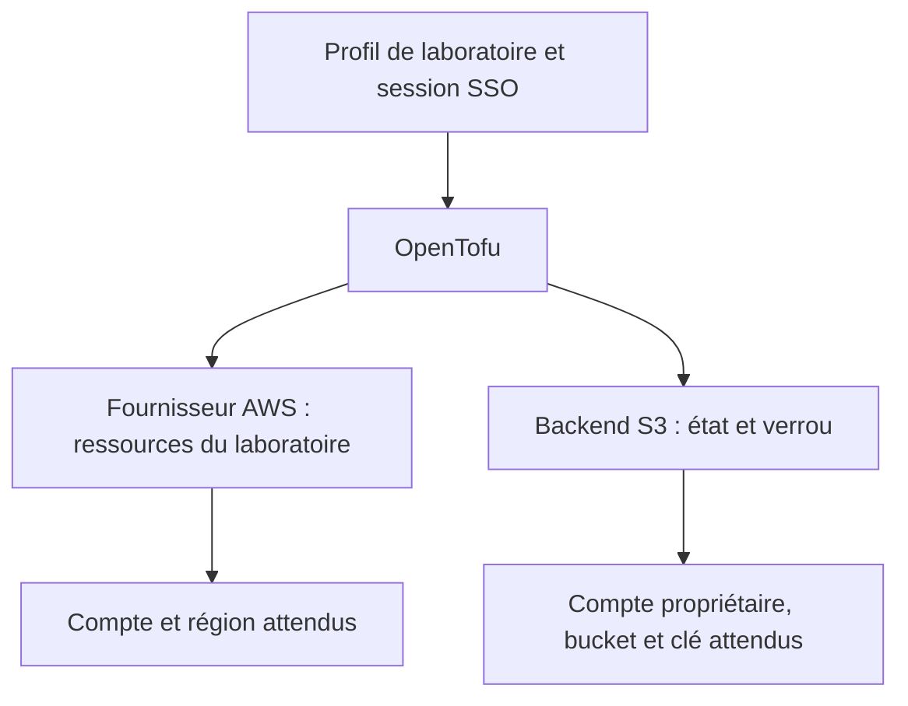

# AWS : savoir qui agit et protéger l’état

**Statut : guide de conception et de préparation du jalon 05. Aucune exécution sur un compte AWS n’est attestée par ce document.** Les résultats observés, lorsqu’ils existent, figurent dans le [registre de validation](validation.md). Consultez le [jalon 05](../parcours/05-cloud-opentofu/README.md) pour l’ordre des opérations.

Une commande correcte peut viser le mauvais compte. Un état perdu peut rendre des ressources existantes invisibles à OpenTofu. Avant de créer le laboratoire, vous devez donc pouvoir répondre à deux questions : « avec quelle identité vais-je agir ? » et « où conserverai-je la correspondance entre mon code et les ressources ? »

## 1. Trois éléments différents

| Élément | Question traitée | Exemple du parcours |
| --- | --- | --- |
| Identifiants temporaires (*credentials*) | Qui peut signer les requêtes AWS ? | Session obtenue avec IAM Identity Center |
| Fournisseur (*provider*) AWS | Dans quel compte et quelle région gérer les ressources ? | `expected_account_id`, région `eu-west-3` |
| Stockage de l’état (*backend*) | Où lire et écrire la mémoire d’OpenTofu ? | Bucket S3 et objet `taskboard/lab/foundations.tfstate` |



Le fournisseur et le backend sont configurés séparément. Un garde-fou placé dans le fournisseur ne protège pas à lui seul l’accès au backend, utilisé dès l’initialisation. Le parcours demande `allowed_account_ids` dans les deux configurations. Cette option borne le compte de l’identité employée ; elle ne remplace pas l’examen du rôle ni la vérification du propriétaire du bucket. [Configuration du fournisseur AWS](https://registry.terraform.io/providers/hashicorp/aws/latest/docs/html), [backend S3 d’OpenTofu](https://opentofu.org/docs/v1.12/language/settings/backends/s3/).

## 2. Préparer un accès de laboratoire avec SSO

Il faut un compte AWS réservé à cet apprentissage et un accès IAM Identity Center déjà attribué. L’administrateur vous fournit l’adresse du portail, la région du service d’identité, le compte et le rôle autorisés. La région du portail SSO peut différer de celle des ressources. Ne créez pas une clé d’accès permanente pour contourner un accès SSO manquant.

Une fois ces informations obtenues, configurez un profil nommé `taskboard-lab` dans votre propre terminal :

```sh
aws configure sso --profile taskboard-lab
aws sso login --profile taskboard-lab
```

La première commande configure le profil local ; la seconde ouvre la procédure de connexion. Choisissez le compte et le rôle convenus. Une session expirée se renouvelle avec `aws sso login` ; elle ne se répare pas en copiant un jeton dans le dépôt. Cette préparation est à effectuer par le titulaire du compte, sans partager les fichiers de configuration ni les caches de session. [Configurer IAM Identity Center avec AWS CLI](https://docs.aws.amazon.com/cli/latest/userguide/cli-configure-sso.html).

Pour cette session de terminal :

```sh
export AWS_PROFILE=taskboard-lab
export AWS_REGION=eu-west-3
export AWS_IGNORE_CONFIGURED_ENDPOINT_URLS=true
export AWS_PAGER=""
aws sts get-caller-identity \
  --profile "$AWS_PROFILE" \
  --region "$AWS_REGION" \
  --output json
```

Le résultat fournit `Account`, `Arn` et `UserId`. Comparez le compte de douze chiffres à celui communiqué **avant** cette commande. Examinez aussi le rôle dans l’ARN de session : deux rôles d’un même compte peuvent avoir des responsabilités différentes. Ne définissez jamais le compte « attendu » en recopiant automatiquement le compte observé : le contrôle accepterait alors toute identité. Cet appel identifie l’acteur ; son succès ne prouve pas qu’il peut créer un réseau ou accéder au bucket d’état. [Référence `get-caller-identity`](https://docs.aws.amazon.com/cli/latest/reference/sts/get-caller-identity.html).

Le nom du profil n’est pas un secret, mais il n’est pas une preuve d’identité. Les variables d’environnement et les profils peuvent influencer différemment les outils. Pour ce parcours SSO, le contrôle préalable doit refuser une configuration ambiguë : anciennes clés exportées, jeton d’identité web concurrent ou adresse d’API personnalisée. Il doit signaler le **nom** des paramètres en conflit sans afficher leur valeur. N’utilisez pas `env`, `set`, `--debug` ou la lecture d’un fichier de credentials pour constituer une preuve publique. [Variables et priorités AWS CLI](https://docs.aws.amazon.com/cli/latest/userguide/cli-configure-envvars.html).

Gardez `AWS_IGNORE_CONFIGURED_ENDPOINT_URLS=true` dans le terminal qui exécutera aussi OpenTofu : les outils et SDK compatibles ignorent alors les adresses d’API personnalisées provenant de leur configuration partagée. Ce réglage ne neutralise pas une adresse fournie explicitement au client. Le parcours exclut donc aussi les arguments `endpoints`, les anciennes variables telles que `AWS_S3_ENDPOINT` et les configurations d’émulateur. [Configuration des adresses d’API dans les SDK AWS](https://docs.aws.amazon.com/sdkref/latest/guide/feature-ss-endpoints.html).

Depuis la racine du dépôt, remplacez `NUMERO_DU_COMPTE_LABO` par le compte de douze chiffres convenu, puis lancez le contrôle en lecture seule :

```sh
node scripts/cloud-preflight.mjs \
  --account NUMERO_DU_COMPTE_LABO \
  --profile taskboard-lab \
  --region eu-west-3
```

Ce script vérifie versions, cohérence de l’environnement, compte retourné par STS et forme d’une session de rôle temporaire. Il ne crée pas de session SSO et ne prouve ni les permissions de ce rôle, ni son origine SSO, ni que ce rôle précis est celui convenu : la comparaison avec l’accès attribué reste nécessaire.

## 3. Séparer l’amorçage et les fondations

Le dépôt distingue trois répertoires :

| Répertoire | Responsabilité | État |
| --- | --- | --- |
| `infra/repetition` | Répétition locale des mécanismes, sans AWS | Local et jetable selon son guide |
| `infra/bootstrap-state` | Création du stockage d’état | Local, à conserver et protéger |
| `infra/foundations` | Fondations AWS du laboratoire | Distant, dans S3 |

Le bucket doit exister avant de servir de backend. L’amorçage (*bootstrap*) résout ce problème avec un état local séparé. Cet état n’est pas jetable : il décrit le bucket qui protège les états suivants. Conservez-en une sauvegarde privée. Détruire les fondations ne doit pas entraîner la destruction de ce bucket.

Les versions retenues pour cette livraison sont OpenTofu **1.12.6**, le fournisseur AWS **6.66.0** et le fournisseur local **2.9.1** pour la répétition. Ce sont les références du parcours, pas une invitation à mettre à jour automatiquement. Les fichiers de verrouillage des dépendances doivent accompagner le code ; les états restent privés.

Le contrat du bucket est explicite : blocage des quatre formes d’accès public, propriété `BucketOwnerEnforced`, versionnement activé, chiffrement SSE-S3 `AES256`, refus des requêtes sans TLS, `force_destroy=false` et protection OpenTofu `prevent_destroy`. Ces choix réduisent l’exposition et les suppressions accidentelles. `prevent_destroy` reste un contrôle du code OpenTofu : il ne bloque pas une suppression effectuée directement avec des droits AWS suffisants et disparaît si le bloc de ressource est retiré du code. [Mesures de sécurité Amazon S3](https://docs.aws.amazon.com/AmazonS3/latest/userguide/security-best-practices.html), [cycle de vie des ressources OpenTofu](https://opentofu.org/docs/language/resources/behavior/).

Pour le backend des fondations, le parcours utilise `encrypt=true` et `use_lockfile=true`, avec le seul espace de travail (*workspace*) `default`. Le verrou repose sur S3 ; aucune table DynamoDB ni clé KMS dédiée n’est requise par ce choix. Le verrou empêche deux opérations concurrentes d’écrire le même état. Le versionnement conserve des versions antérieures ; ces deux mécanismes répondent à des problèmes différents. [Backend S3 et verrouillage natif](https://opentofu.org/docs/v1.12/language/settings/backends/s3/).

Avant d’initialiser ce backend, le contrôle doit comparer bucket, région et propriétaire attendus. `aws s3api head-bucket` accepte `--expected-bucket-owner` et échoue si le propriétaire ne correspond pas. Un nom de bucket contenant un numéro de compte ne suffit pas à établir sa propriété. [Référence `head-bucket`](https://docs.aws.amazon.com/cli/latest/reference/s3api/head-bucket.html).

Lors de la toute première activation du versionnement, AWS recommande d’attendre quinze minutes avant les premières écritures ou suppressions d’objets, afin de laisser la configuration se propager. Prévoir ce délai après l’amorçage et avant l’utilisation du backend évite de confondre un éventuel `404 NoSuchKey` transitoire avec une perte d’état. Le verrou est lui aussi un objet écrit dans S3. [Activation du versionnement S3](https://docs.aws.amazon.com/AmazonS3/latest/API/API_PutBucketVersioning.html).

## 4. Accorder les droits correspondant à chaque rôle

La création initiale du bucket exige des droits différents de son utilisation quotidienne. Le rôle d’amorçage peut en administrer les protections ; le rôle courant doit accéder à l’état et gérer seulement les fondations prévues. Un lecteur des plans n’a pas nécessairement besoin du droit de les appliquer. Ces séparations sont des exigences du parcours, à traduire en politiques IAM puis à éprouver sur le compte de laboratoire.

Pour le cycle courant sur l’espace `default`, l’objectif est de limiter l’accès S3 à la liste nécessaire au backend, à la lecture/écriture de l’objet d’état et à la lecture/création/suppression de son verrou `.tflock`. La suppression de versions historiques, la suppression du bucket et la gestion d’autres espaces de travail restent hors de ce rôle. La politique exacte doit être vérifiée sur la version retenue : un test simulé ne prouve pas qu’une restriction IAM fonctionne.

Un préfixe de ressource ou une étiquette (*tag*) facilite l’inventaire ; ce n’est pas une frontière de sécurité universelle. Il faut aussi borner les actions, les ressources et les conditions réellement prises en charge par chaque service. N’ajoutez pas une politique d’administration générale pour faire disparaître un refus sans comprendre l’action manquante. [Principe du moindre privilège IAM](https://docs.aws.amazon.com/IAM/latest/UserGuide/best-practices.html).

## 5. Traiter états et plans comme des données sensibles

L’état contient les identifiants et attributs des ressources, parfois des données confidentielles. Le marquage `sensitive` masque des affichages ; il n’efface pas la valeur de l’état. Un plan enregistré peut contenir configuration et valeurs d’entrée, même lorsque l’affichage du terminal les masque. Le chiffrement S3 protège le stockage chez AWS, pas automatiquement les fichiers téléchargés ni les plans locaux. [Données sensibles dans l’état](https://opentofu.org/docs/language/state/sensitive-data/), [variables sensibles](https://opentofu.org/docs/language/values/variables/), [plans enregistrés](https://opentofu.org/docs/cli/commands/plan/).

Dans le parcours :

- Gardez les états, sauvegardes d’état, plans binaires et exports JSON dans des emplacements privés ignorés par Git, avec accès limité à votre utilisateur.
- Conservez les preuves partageables sous forme de synthèses relues : versions, commit, types de ressources, compte masqué si nécessaire, résultat du contrôle et actions proposées.
- Ne publiez pas les fichiers `.terraform/`, les caches SSO, les credentials, ni les sorties brutes de `tofu show -json`. Cette dernière commande peut révéler les valeurs sensibles. [Référence `tofu show`](https://opentofu.org/docs/cli/commands/show/).
- Vérifiez `git status` avant chaque ajout. `.gitignore` évite des ajouts accidentels ; il ne chiffre rien et ne retire pas un fichier déjà suivi.

Le chiffrement natif des états et plans par OpenTofu constitue une couche supplémentaire possible. Il demande un dispositif de gestion et de récupération des clés ; la perte de la clé peut rendre l’état inutilisable. Il n’est pas activé implicitement par le chiffrement SSE-S3 de ce laboratoire. [Chiffrement d’état et de plan](https://opentofu.org/docs/language/state/encryption/).

## 6. Ce que les contrôles doivent prouver avant une écriture

Ces exigences définissent la recette du parcours. Elles combinent contrôles automatisés et relecture ; leur présence ici n’affirme pas qu’une exécution AWS a réussi. Les scripts `cloud-preflight.mjs` et `review-cloud-plan.mjs` ne constituent pas une frontière IAM et n’appliquent pas le plan à votre place.

| Contrôle | Refus attendu |
| --- | --- |
| Compte attendu fourni indépendamment, profil et région explicites | Valeur absente, compte observé différent ou session expirée |
| Rôle de laboratoire identifié et cohérent avec l’opération | Identité inattendue, compte racine, identité impossible à établir |
| Même contexte pour AWS CLI, fournisseur et backend | Paramètres d’authentification ou adresses d’API concurrents |
| Répertoire, bucket, clé, région et workspace attendus | Cible différente de `infra/foundations` ou workspace autre que `default` |
| État accessible et verrou conservé | Erreur d’accès, verrou détenu ou état attendu introuvable |
| Plan enregistré, identifié et relu | Plan d’un autre laboratoire, fichier remplacé ou action inattendue |

L’absence d’état n’est normale qu’à une première création identifiée comme telle. Si des fondations ont déjà existé, un plan qui propose soudain de tout recréer demande une enquête avant tout `apply`. Ne le rendez pas « acceptable » en supprimant les caches ou les preuves.

Le contrôle de l’environnement ne remplace pas la lecture de l’espace de travail effectivement sélectionné : `tofu -chdir=infra/foundations workspace show` doit afficher `default`, après initialisation. Des options cachées dans `TF_CLI_ARGS` ou un répertoire de données déplacé par `TF_DATA_DIR` changeraient les conditions de l’exercice ; le parcours les exclut. [Variables d’environnement OpenTofu](https://opentofu.org/docs/cli/config/environment-variables/).

Le retrait doit viser exclusivement les ressources gérées par l’état des fondations. Suivez les commandes natives du jalon pour enregistrer un plan de destruction et produire son JSON privé. Le relecteur de plan doit recevoir `--module foundations --intent destroy`. Relisez les ressources concernées et confirmez le laboratoire identifié. Juste avant d’appliquer le plan binaire correspondant, relancez le contrôle d’identité et vérifiez la cible ; ne remplacez pas ce fichier entre relecture et application. Le bootstrap et ses versions d’état sont conservés. Une liste de suppressions ne se déduit jamais d’un simple préfixe de nom ; aucune purge globale de compte ne fait partie du parcours.

Dans les essais sans compte, il faut simuler aussi les refus : compte incorrect, ARN incohérent, session expirée, mauvais bucket, plan modifié, workspace inattendu et tentative de retrait du bootstrap. Un résultat positif avec des doubles d’API (*mocks*) ne valide que la logique testée, pas les permissions réelles, les coûts, les services AWS ou le verrou S3.

## 7. Reprendre un état sans aggraver l’incident

Un verrou qui reste présent impose d’abord de retrouver son propriétaire et de vérifier qu’aucune exécution n’est encore active. N’utilisez pas automatiquement `-lock=false` ou `force-unlock`. Cette dernière opération ne convient qu’à un verrou devenu orphelin, identifié avec certitude ; déverrouiller une opération active autoriserait des écritures concurrentes. [Verrouillage d’état OpenTofu](https://opentofu.org/docs/language/state/locking/).

Si l’état paraît perdu ou incohérent, procédez dans cet ordre :

1. Suspendez les écritures du laboratoire et notez compte, région, bucket, clé, workspace, commit et dernière opération connue.
2. Distinguez une erreur d’identité, une session expirée, un refus d’accès, une mauvaise clé S3 et une véritable disparition. Ne recréez pas immédiatement les ressources.
3. Préservez l’état courant et les informations de versions dans un emplacement privé. Cherchez la dernière version cohérente avec les opérations réellement terminées.
4. Comparez son contenu à l’inventaire AWS. Une ancienne copie de l’état ne remet pas les ressources cloud dans leur ancien état.
5. Préparez une reprise relue, puis un nouveau plan pour constater les écarts avant toute modification des ressources.

S3 permet de récupérer une version antérieure et de la recopier comme nouvelle version courante. Un marqueur de suppression peut aussi expliquer qu’un objet versionné semble absent. La bonne version ne se choisit pas uniquement par sa date : il faut retrouver les ressources qu’elle décrivait. [Restauration de versions S3](https://docs.aws.amazon.com/AmazonS3/latest/userguide/RestoringPreviousVersions.html), [marqueurs de suppression](https://docs.aws.amazon.com/AmazonS3/latest/userguide/DeleteMarker.html).

`tofu state push` vérifie notamment la lignée de l’état (*lineage*) et son numéro de série. Un refus est une information à examiner, pas une invitation à ajouter `-force`. La manipulation manuelle d’état demande une procédure de reprise spécifique ; elle ne fait pas partie du nettoyage courant. [Référence `state push`](https://opentofu.org/docs/cli/commands/state/push/).

Enfin, changer de backend n’est pas restaurer une sauvegarde. `init -migrate-state` sert à transférer un état existant vers un autre backend ; `init -reconfigure` réinitialise la configuration du backend sans effectuer ce transfert. Vérifiez la destination et sauvegardez les éléments nécessaires avant une migration. Ne choisissez pas l’option au hasard pour supprimer un message d’erreur. [Initialisation et migration du backend](https://opentofu.org/docs/cli/commands/init/).

La preuve attendue est une infrastructure retrouvée avec un état cohérent, suivie d’un plan compris. « La commande s’est terminée sans erreur » ne suffit pas à démontrer la reprise.
