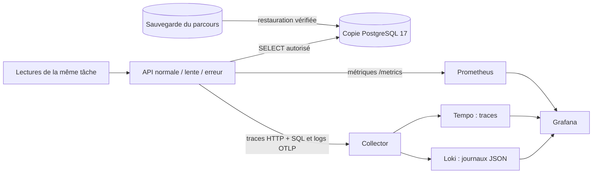

# Jalon 07 — Observer une requête de bout en bout

## 1. Le problème

Une page répond en une seconde et demie. Le serveur fonctionne et PostgreSQL accepte les connexions. Faut-il augmenter les ressources de la base, multiplier les API ou chercher ailleurs ? Un graphe seul ne tranche pas. Ce laboratoire relie une mesure agrégée, le journal d’une requête précise et les opérations qui composent sa trace.

La base TaskBoard du parcours reste la source autoritative. Nous restaurons une copie de sa sauvegarde dans un projet Docker distinct, `taskboard-observabilite`, puis vérifions exactement la tâche témoin : `id`, `title` et `created_at`. Les trois API du laboratoire utilisent un rôle PostgreSQL qui peut lire les tables mais ne peut pas y insérer de données. Ce transfert est une copie pédagogique ; il ne constitue ni une bascule de production ni une réplication.

## 2. Lire l’architecture



Le Collector reçoit des traces et des journaux ; il ne fabrique pas les spans SQL. L’enveloppe applicative mesure les requêtes PostgreSQL et crée ces spans. Prometheus collecte séparément les métriques déjà exposées par TaskBoard. Les trois signaux ont des trajets différents : une interruption du Collector peut laisser les graphes Prometheus à jour.

| Accès local | Adresse |
|---|---|
| API normale, copie en lecture seule | `http://127.0.0.1:3010` |
| API lente, délai simulé de 1,5 seconde | `http://127.0.0.1:3011` |
| API en erreur, réponse métier 503 | `http://127.0.0.1:3012` |
| Tableau de bord Grafana | `http://127.0.0.1:3300/d/taskboard-observabilite` |
| Prometheus et règles d’alerte | `http://127.0.0.1:9090` |
| API Loki / API Tempo | `127.0.0.1:3100` / `127.0.0.1:3200` |
| Santé du Collector | `http://127.0.0.1:13133` |

Les ports sont liés à `127.0.0.1`. Les protocoles OTLP et PostgreSQL ne sont pas publiés sur l’hôte. Grafana autorise localement un accès anonyme en lecture ; les composants et identifiants publics de laboratoire ne conviennent pas à une exposition sur Internet.

## 3. Comprendre ce qui est mesuré

`app-observe.mjs` appelle le même `createApp` que l’application principale. Son enveloppe crée un span serveur HTTP, transporte le contexte W3C lorsqu’il est fourni et ajoute `X-Trace-ID` à la réponse. Chaque requête SQL métier devient un span enfant. Le logger conserve le JSON de l’application et y ajoute `trace_id`, `span_id` et `scenario`. Les journaux corrélés passent par le SDK OpenTelemetry et le Collector vers l’ingestion OTLP native de Loki. Les valeurs des paramètres SQL, les titres des tâches et le mot de passe ne sont pas exportés dans les traces.

Les routes sont normalisées : `/api/tasks/42` devient `/api/tasks/:id`. Un identifiant de tâche n’est pas un label de métrique. Cela borne le nombre de séries au lieu de créer une série par requête. Sans contexte parent entrant, le SDK échantillonne toutes les requêtes du petit laboratoire ; lorsqu’un parent est fourni, il respecte sa décision d’échantillonnage. Une production doit définir cette politique, les données autorisées et un budget de collecte.

La durée HTTP est mesurée par l’application et exposée dans un histogramme cumulatif. Les buckets ne contiennent pas la liste des durées individuelles. `histogram_quantile` estime le p95 à partir de leur répartition : un délai réel de 1,5 seconde peut produire une estimation proche de 2,4 secondes avec ces bornes. La trace de la requête montre sa durée individuelle et aide à comprendre cet écart.

## 4. Importer, démarrer et vérifier

Prévoir Node.js 24.19.0, Docker avec Compose et plusieurs gigaoctets libres pour les images. Toutes les commandes partent de la racine du dépôt. Reprendre le fichier `taskboard.dump` produit par le jalon Docker ainsi que le JSON de la tâche témoin présente dans cette sauvegarde. Les chemins ci-dessous sont à remplacer par ceux de votre exécution.

```bash
bash observabilite/importer-snapshot.sh \
  backups/VOTRE-EXECUTION/taskboard.dump \
  preuves/tache-temoin.json
```

L’import démarre uniquement sa propre base PostgreSQL. Il refuse de restaurer sur une copie qui contient déjà `tasks`. Il exécute la restauration dans une transaction, vérifie la version majeure 17, le checksum de `001_init`, l’identité exacte du témoin et l’absence de droit `INSERT` pour `lab_reader`. Le résultat est enregistré dans `observabilite/imports/resultat.json`. Ces fichiers et les sauvegardes restent hors Git.

Le refus d’une seconde importation protège la copie existante. Pour reprendre une séance, conserver les volumes et passer directement à la vérification. Si le témoin ne correspond pas à la sauvegarde, retrouver la bonne paire de fichiers ; ne pas effacer les données pour masquer le problème.

```bash
bash scripts/verify-observability.sh
```

Le script construit une image locale dédiée à l’observation, démarre uniquement `taskboard-observabilite`, attend les services, puis envoie pendant environ 80 secondes des lectures de la tâche sur les trois API. Il vérifie les réponses 200/200/503, la lenteur mesurée, les trois cibles Prometheus, le p95, deux alertes déclenchées, le tableau de bord provisionné, les journaux retrouvés par trace et le parentage HTTP → SQL. Il n’écrit aucune tâche.

Le résultat se trouve dans le dossier `observabilite/preuves/verification-XXXXXX/` annoncé à la fin. Pour conclure au succès, le script doit terminer avec un code de sortie nul **et** son `resultat.json` porter `statut: valide` : la vérification des règles par `promtool` intervient aussi dans le script. Un simple démarrage de conteneurs ne suffit pas. Les preuves contiennent les données utiles au diagnostic et restent ignorées par Git.

Pour observer manuellement, reprendre le `temoin_id` de la preuve d’import :

```bash
TEMOIN_ID=1 # remplacer par l'identifiant de votre preuve
curl -i "http://127.0.0.1:3010/api/tasks/$TEMOIN_ID"
curl -i "http://127.0.0.1:3011/api/tasks/$TEMOIN_ID"
curl -i "http://127.0.0.1:3012/api/tasks/$TEMOIN_ID"
```

Les API de ce laboratoire servent à lire. Le formulaire de création de l’application n’a pas vocation à être utilisé ici : son rôle PostgreSQL ne possède pas de droit d’écriture. Les créations du parcours restent dirigées vers sa source autoritative, en suivant son propre état de service.

## 5. Provoquer et distinguer deux pannes

Le scénario `lent` applique le délai avant l’appel SQL. Le scénario `erreur` renvoie un 503 avant cet appel. Les simulations exigent explicitement `LAB_MODE=true`, défini seulement dans ce Compose de laboratoire.

Dans Grafana, comparer le débit, le p95 et les 5xx. Ouvrir ensuite un journal du scénario concerné, puis son champ `TraceID`. La trace lente devrait présenter un span HTTP long et un span SQL beaucoup plus court. La trace en erreur ne devrait comporter aucun span SQL. Accuser la base à partir du seul statut 503 serait une conclusion sans preuve.

La panne supplémentaire suivante agit uniquement sur la collecte :

```bash
docker compose -p taskboard-observabilite \
  -f observabilite/compose.yaml stop collector
curl -i "http://127.0.0.1:3010/api/tasks/$TEMOIN_ID"
docker compose -p taskboard-observabilite \
  -f observabilite/compose.yaml start collector
```

Une réponse métier peut rester correcte tandis que son export de télémétrie rencontre une erreur. Les files d’attente de ce laboratoire sont en mémoire et bornées. Elles ne garantissent pas la conservation pendant une panne longue ou un redémarrage ; ne pas interpréter l’absence d’une trace comme la preuve que la requête n’a jamais existé.

## 6. Diagnostiquer dans l’ordre

```bash
docker compose -p taskboard-observabilite \
  -f observabilite/compose.yaml ps -a
docker compose -p taskboard-observabilite \
  -f observabilite/compose.yaml logs --tail 100 collector tempo loki
```

Si aucune métrique n’arrive, vérifier d’abord la page **Targets** de Prometheus et `/metrics` de chaque API. Si les métriques arrivent mais les traces manquent, inspecter le Collector et Tempo. Si la trace existe mais le journal est introuvable, chercher le même `trace_id` dans Loki et contrôler la plage horaire. Si le journal existe mais le lien ne fonctionne pas, vérifier la source de données Grafana `loki`, son champ dérivé et l’UID `tempo`.

Pour une API non prête, consulter sa réponse `/readyz`, l’état de sa base de laboratoire et la preuve d’import. `/healthz` répond à une autre question : le processus peut-il traiter une requête HTTP simple ? Réinstaller tout l’environnement avant de distinguer ces cas détruirait des indices et ne résoudrait pas nécessairement la cause.

## 7. Passer à une approche de production

Les deux règles Prometheus utilisent une fenêtre d’une minute et une durée de 15 secondes afin que l’exercice soit visible rapidement. Ce ne sont pas des SLO recommandés pour un service réel. Le jalon suivant ajoute le parcours d’une notification jusqu’à un récepteur local ; ce laboratoire prouve l’état `firing` dans Prometheus sans promettre l’envoi d’un message à une équipe.

Une production doit traiter l’authentification, TLS, les droits des opérateurs, la collecte des données sensibles, la disponibilité des backends, leurs sauvegardes, la rétention et la saturation. Ici Prometheus conserve 24 heures ; les autres volumes pédagogiques persistent jusqu’à une suppression explicite. Surveiller leur espace : un volume conservé peut remplir un disque. Aucune haute disponibilité ni restauration automatique de la télémétrie n’est revendiquée.

L’arrêt ordinaire conserve la base copiée et les données d’observation :

```bash
docker compose -p taskboard-observabilite \
  -f observabilite/compose.yaml down
```

Ne pas ajouter `-v` si l’on souhaite reprendre la séance. Cette commande ne cible ni le Compose source ni Kind. Une copie de base en lecture seule n’est pas une sauvegarde de la source mise à jour en continu.

## 8. Questions d’entretien

1. Pourquoi un p95 estimé par histogramme diffère-t-il d’une durée de trace ?
2. Pourquoi ne faut-il pas placer le `trace_id` dans les labels Prometheus ?
3. Comment prouver qu’un span SQL appartient à la requête HTTP étudiée ?
4. Une API répond 200 et le Collector est arrêté : quel service est en panne ?
5. Qu’ajouter avant d’exposer les outils de ce laboratoire sur un réseau partagé ?

## 9. Challenge

À partir de deux nouvelles requêtes, une lente et une en erreur, rédiger un diagnostic de six lignes : symptôme, mesure agrégée, identifiant de trace, durée HTTP, présence et durée SQL, cause soutenue par les faits. Retrouver aussi le JSON de la tâche témoin après un arrêt puis une reprise du seul projet d’observation. Ne modifier ni la source ni les volumes.

## 10. Corrigé et références

Le [corrigé](corrige.md) détaille les éléments attendus et les pièges d’interprétation. Le [registre de validation](validation.md) distingue les vérifications statiques, l’import et les essais exécutés.

Versions épinglées et digests multiarchitecture AMD64/ARM64 vérifiés le 24 septembre 2026 : Collector Contrib 0.161.0, Prometheus 3.14.0, Grafana 13.2.2, Loki 3.7.8 et Tempo 3.0.3. Le SDK Node OpenTelemetry et ses exporteurs sont épinglés en 0.222.0, son API en 1.9.1 et ses ressources en 2.11.0. Les verrous et `compose.yaml` portent les références exactes.

- [OpenTelemetry JavaScript : instrumentation](https://opentelemetry.io/docs/languages/js/instrumentation/).
- [Export OTLP/HTTP du Collector](https://github.com/open-telemetry/opentelemetry-collector/blob/v0.161.0/exporter/otlphttpexporter/README.md).
- [Ingestion OpenTelemetry native de Loki](https://grafana.com/docs/loki/latest/send-data/otel/).
- [Exemple officiel Tempo 3.0.3 monolithique](https://github.com/grafana/tempo/tree/v3.0.3/example/docker-compose/single-binary).
- [Histogrammes et quantiles Prometheus](https://prometheus.io/docs/practices/histograms/).
- [Provisionnement Grafana](https://grafana.com/docs/grafana/latest/administration/provisioning/).
