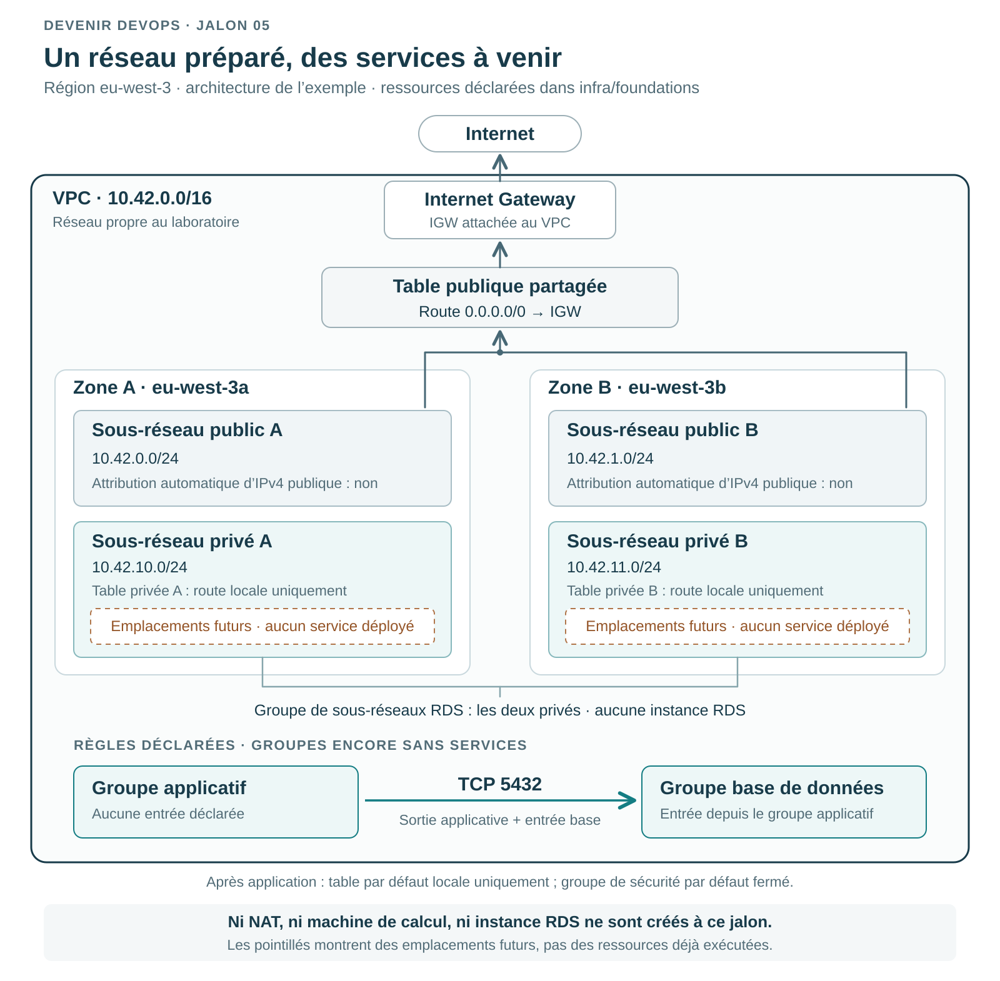
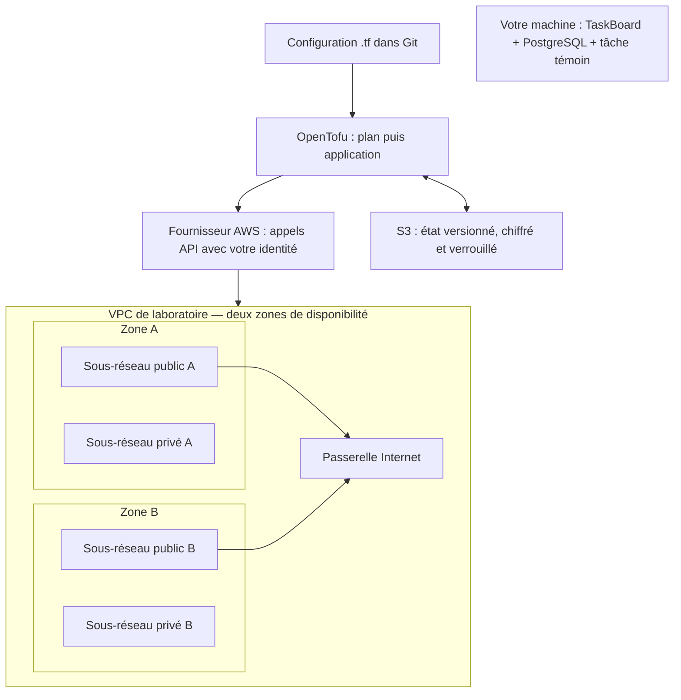
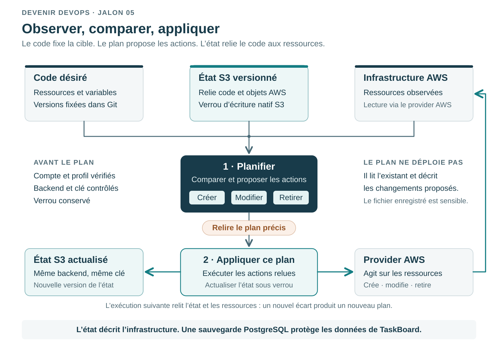

# Jalon 05 — Décrire et contrôler ses fondations AWS avec OpenTofu

**Chapitres 9–10. Atelier rédigé ; validation locale uniquement tant qu’une exécution AWS n’est pas consignée.** Le [registre de validation](../../docs/validation.md) distingue les essais réalisés des résultats attendus ci-dessous. La version du parcours est `v0.3.0` ; l’application TaskBoard reste en `0.2.0`.

## 1. Le problème : créer un environnement que l’on sait retirer

Au jalon 04, vous avez relié une image à un commit testé. Un ordinateur neuf ne possède pourtant ni votre réseau ni vos réglages. Les reproduire à la main rend les différences difficiles à expliquer. Vous allez décrire une infrastructure par du code (*Infrastructure as Code*, IaC), examiner les changements proposés, provoquer une petite dérive et retirer les ressources sans perdre leur inventaire.

Le résultat AWS est **un réseau vide et son état protégé**. TaskBoard et PostgreSQL restent locaux. Aucun transfert de données, serveur applicatif, cluster Kubernetes ou déploiement de production n’est réalisé ici. Votre tâche témoin du jalon 03 demeure la même : son identifiant, son titre et sa date ne changent pas.

Deux parties se complètent. La répétition locale apprend les gestes avec un fichier et fonctionne sans compte AWS. La seconde décrit l’exécution réelle dans un compte de laboratoire autorisé. Réussir la première ne prouve ni les permissions AWS, ni les quotas, ni la création du réseau.

## 2. Comprendre le schéma avant les commandes

Dans AWS, le réseau virtuel privé (*Virtual Private Cloud*, VPC) délimite votre espace d’adressage. S3 fournit le stockage d’objets utilisé ici pour conserver l’état ; il ne remplace pas une base de données.



*Les services en pointillés sont des emplacements futurs : aucune application ni base AWS n’est créée dans cet atelier.*

<details>
<summary>Voir aussi la vue simplifiée en Mermaid</summary>



</details>

Les flèches vers AWS représentent l’administration de l’infrastructure, pas le trafic de TaskBoard. Une zone de disponibilité (*Availability Zone*, AZ) désigne une implantation isolée au sein d’une région. Deux zones préparent une répartition future ; sans application ni base déployées, elles ne constituent pas une haute disponibilité démontrée.

Une table de routage (*route table*) choisit la destination d’un paquet. Ici, les sous-réseaux publics ont une route vers la passerelle Internet ; les privés n’en ont pas. Aucune passerelle NAT n’est créée : une future machine privée ne pourra pas télécharger arbitrairement des paquets depuis Internet. « Public » décrit le routage ; ce mot n’accorde ni adresse publique ni permission réseau à lui seul. Voir les [tables de routage AWS](https://docs.aws.amazon.com/vpc/latest/userguide/VPC_Route_Tables.html).

## 3. Le fonctionnement technique

Le **fournisseur** (*provider*) traduit les ressources du langage OpenTofu en appels à une API. Le module local utilise `local`, les modules AWS utilisent `aws`. Le fichier `.terraform.lock.hcl` fixe les versions et empreintes des fournisseurs ; il est versionné avec le code. Ce verrou de dépendances est distinct du verrou d’accès à l’état.

L’**état** (*state*) relie une adresse de ressource à l’objet créé. Il ne remplace ni le code ni une sauvegarde de PostgreSQL. Sans lui, OpenTofu ne retrouve pas automatiquement ce qu’un ancien atelier avait créé. Les états et plans peuvent contenir des informations sensibles : ils restent hors Git. Voir le [rôle de l’état](https://opentofu.org/docs/language/state/).

Le **plan** compare configuration et ressources observées, puis propose les actions : création `+`, modification `~`, suppression `-` ou remplacement `-/+`. `plan` ne réalise pas ces actions ; `apply` les exécute. Un plan vide indique généralement `No changes` — « aucun changement ». Voir la [commande plan](https://opentofu.org/docs/cli/commands/plan/).

Le stockage distant de l’état (*backend*) est S3. Il faut donc créer son compartiment avec `infra/bootstrap-state`, qui conserve son propre état local. `infra/foundations` peut ensuite utiliser S3. Le versionnement aide à retrouver une révision ; le verrou natif S3 empêche deux écritures concurrentes normales. Ces mécanismes ne dispensent ni de la gestion des identités et des accès (*Identity and Access Management*, IAM), ni d’une procédure de récupération. Voir le [backend S3 d’OpenTofu](https://opentofu.org/docs/language/settings/backends/s3/).



### Et Terraform ?

Terraform et OpenTofu partagent de nombreux concepts : configuration déclarative, ressources, variables, fournisseurs, plan et état. Les blocs `provider` de votre fichier `provider.tf` ressemblent donc à ceux que vous lirez dans un projet Terraform. Les explications précédentes vous aideront à comprendre les [fournisseurs Terraform](https://developer.hashicorp.com/terraform/language/block/provider) et son [état](https://developer.hashicorp.com/terraform/language/state).

Nous retenons **OpenTofu 1.12.6** pour disposer d’une seule chaîne d’exercice, fixée et testée. Les essais de ce parcours n’ont pas été exécutés avec Terraform. Une ressemblance de fichiers ne garantit pas l’interchangeabilité des versions, du backend, des fonctions ou des formats d’état. N’alternez pas les deux binaires sur le même état pour essayer une commande. Une migration demande de sauvegarder code et état, vérifier la compatibilité et tester une modification limitée ; suivez le [guide de migration d’OpenTofu](https://opentofu.org/docs/intro/migration/) correspondant à vos versions.

## 4. Prérequis et état d’entrée

Vous avez terminé les jalons 01–04 et conservé `preuves/tache-temoin.json`, le volume PostgreSQL et ses sauvegardes. Les commandes partent de la racine du dépôt. Si une commande échoue, arrêtez la séquence et diagnostiquez l’erreur. Le lien `&&` signifie « poursuivre seulement si la commande précédente réussit ». Avant un changement de version Git, vérifiez `git status --short` et enregistrez votre travail. Pour consulter la référence publiée :

```sh
git fetch origin --tags
git switch --detach v0.3.0
node scripts/install-tofu.mjs
export PATH="$PWD/work/bin:$PATH"
tofu version
```

La sortie attendue est OpenTofu **1.12.6**. L’installateur place l’outil dans `work/` et contrôle les empreintes épinglées ; il ne configure aucun compte AWS. Le fournisseur AWS est fixé à **6.66.0**, le fournisseur local à **2.9.1**. Ces versions servent de références à l’atelier.

Créez une branche pour vos exercices, par exemple `git switch -c apprentissage/jalon-05`. Si elle existe déjà, rejoignez-la avec `git switch apprentissage/jalon-05` et vérifiez qu’elle contient bien le code du jalon.

## 5. Première pratique : répéter sans compte cloud

```sh
umask 077
mkdir -p preuves/cloud
tofu -chdir=infra/repetition init -lockfile=readonly
tofu -chdir=infra/repetition validate
tofu -chdir=infra/repetition plan -out="$PWD/preuves/cloud/local.tfplan"
tofu -chdir=infra/repetition show "$PWD/preuves/cloud/local.tfplan"
```

`umask 077` rend les nouveaux fichiers privés pour votre utilisateur, sous réserve des capacités du système de fichiers. `init` télécharge le fournisseur verrouillé. `validate` contrôle la cohérence de la configuration sans vérifier des ressources AWS ; voir la [portée de la validation](https://opentofu.org/docs/cli/commands/validate/).

Le plan doit porter uniquement sur `infra/repetition/run/environnement.json`. Lisez le chemin avant de poursuivre. **Appliquer un plan enregistré ne demande pas une seconde confirmation : la commande suivante exécute le plan affiché.** Ne modifiez pas le fichier de plan entre sa lecture et son application.

```sh
tofu -chdir=infra/repetition apply "$PWD/preuves/cloud/local.tfplan"
cat infra/repetition/run/environnement.json
tofu -chdir=infra/repetition plan
```

Le fichier décrit l’environnement `lab` et son responsable `apprenant`. Le dernier plan doit être vide. Ce fichier est un exercice de gestion de ressource, pas un émulateur de VPC.

### Provoquer une dérive locale

Modifiez seulement le fichier produit :

```sh
printf '%s\n' '{"incident":"modification manuelle de laboratoire"}' \
  > infra/repetition/run/environnement.json
tofu -chdir=infra/repetition plan -out="$PWD/preuves/cloud/local-reparation.tfplan"
tofu -chdir=infra/repetition show "$PWD/preuves/cloud/local-reparation.tfplan"
```

Le code n’a pas changé, mais la ressource observée a changé : c’est une **dérive** (*drift*). Le fournisseur peut présenter la recréation du fichier plutôt qu’une mise à jour. Vérifiez que le plan concerne uniquement le fichier d’exercice, puis :

```sh
tofu -chdir=infra/repetition apply "$PWD/preuves/cloud/local-reparation.tfplan"
cat infra/repetition/run/environnement.json
tofu -chdir=infra/repetition plan
bash scripts/verify-infra.sh
```

Le fichier doit retrouver le contenu déclaré et le plan redevenir vide. Le script final ajoute les contrôles du dépôt, dont une répétition automatisée et des tests avec fournisseurs simulés (*mocks*). Il n’interroge pas votre compte AWS. Sa réussite valide ces contrôles locaux, pas le fonctionnement des API distantes.

## 6. Préparer une identité et une décision de coût

**La suite crée de vraies ressources AWS.** Elle demande un compte de laboratoire autorisé, une région, une identité temporaire autorisée à administrer les ressources prévues et AWS CLI v2. Sans ces prérequis, terminez la partie locale et consignez « exécution AWS non réalisée ».

Installez la CLI depuis les [instructions AWS](https://docs.aws.amazon.com/cli/latest/userguide/getting-started-install.html). Si votre organisation fournit IAM Identity Center, configurez le profil avec `aws configure sso --profile taskboard-lab`, puis `aws sso login --profile taskboard-lab`. Les informations de connexion viennent de l’administrateur du compte ; suivez les [instructions IAM Identity Center](https://docs.aws.amazon.com/cli/latest/userguide/cli-configure-sso.html). Sinon, obtenez un profil à session de rôle temporaire suivant le processus de votre compte ; n’ajoutez aucune clé au dépôt. AWS recommande l’accès fédéré et les [identifiants temporaires](https://docs.aws.amazon.com/IAM/latest/UserGuide/best-practices.html). La fiche [identité et état](../../docs/cloud-identites-et-etat.md) explique le rôle attendu et les configurations concurrentes que le contrôle refuse.

Lisez la [fiche coûts et retrait](../../docs/cloud-couts.md), définissez vos alertes et relevez les ressources déjà présentes. Un budget est un signal avec délai, pas un plafond qui empêcherait toute dépense.

Saisissez l’identifiant de compte à douze chiffres **attendu**, vérifié indépendamment dans le compte de laboratoire. `read` attend votre saisie sur la ligne suivante :

```sh
export AWS_PROFILE=taskboard-lab
export AWS_REGION=eu-west-3
export AWS_IGNORE_CONFIGURED_ENDPOINT_URLS=true
export AWS_PAGER=""
read -r TASKBOARD_AWS_ACCOUNT
node scripts/cloud-preflight.mjs \
  --account "$TASKBOARD_AWS_ACCOUNT" \
  --profile "$AWS_PROFILE" --region "$AWS_REGION"
```

Ce contrôle préalable (*preflight*) lit l’identité et vérifie les versions ; il ne crée rien. Le compte annoncé doit correspondre au compte attendu. Une différence est un arrêt de l’atelier. Un succès ne démontre pas encore toutes les permissions de création. Le réglage `AWS_IGNORE_CONFIGURED_ENDPOINT_URLS` écarte les adresses d’API personnalisées de la configuration partagée ; il doit rester actif pour AWS CLI et OpenTofu pendant cet atelier.

## 7. Amorcer le stockage d’état

Pour une première configuration seulement, copiez les exemples ; ne remplacez pas des fichiers personnalisés déjà utilisés :

```sh
cp infra/bootstrap-state/terraform.tfvars.example infra/bootstrap-state/terraform.tfvars
cp infra/foundations/terraform.tfvars.example infra/foundations/terraform.tfvars
```

Ouvrez ces deux copies dans votre éditeur. Renseignez le même `expected_account_id`, `aws_region = "eu-west-3"` et un `owner` qui identifie l’atelier sans donnée personnelle publiée. Conservez `project = "taskboard"` et `environment = "lab"`, fixes pour ce parcours. Dans l’amorçage, choisissez un `state_bucket_name` unique parmi les compartiments S3 de la partition AWS, en lettres minuscules, chiffres et tirets. Remplacez le modèle ; un nom déjà utilisé reste indisponible.

Le fichier `backend.hcl.example` montre le contrat du futur backend : compartiment, région et compte attendu, `key = "taskboard/lab/foundations.tfstate"`, `encrypt = true` et `use_lockfile = true`. La sortie d’amorçage produira votre copie après création ; elle ne contiendra aucun secret. Le fournisseur et le backend ont chacun leur garde-fou de compte : ce sont deux clients AWS distincts.

Dans les fondations, fournissez deux zones disponibles de la région dans `availability_zones`. Vous pouvez les lire avec :

```sh
aws ec2 describe-availability-zones --region "$AWS_REGION" \
  --filters Name=state,Values=available Name=zone-type,Values=availability-zone \
  --query 'AvailabilityZones[].ZoneName' --output text
```

Conservez la plage `10.42.0.0/16` pour ce laboratoire isolé. Cette notation CIDR exprime un préfixe d’adresses : `/16` fixe les seize premiers bits de l’adresse IPv4. Le module la découpe en quatre sous-réseaux `/24` : `10.42.0.0/24` et `10.42.1.0/24` publics, `10.42.10.0/24` et `10.42.11.0/24` privés. Le caractère public ou privé vient du routage, pas du numéro choisi. Avant une liaison avec un réseau existant, il faudra rechercher les chevauchements. Puis préparez le plan d’amorçage :

```sh
node scripts/cloud-preflight.mjs --account "$TASKBOARD_AWS_ACCOUNT" \
  --profile "$AWS_PROFILE" --region "$AWS_REGION" &&
tofu -chdir=infra/bootstrap-state init -lockfile=readonly &&
tofu -chdir=infra/bootstrap-state workspace show &&
tofu -chdir=infra/bootstrap-state plan -out="$PWD/preuves/cloud/bootstrap.tfplan" &&
tofu -chdir=infra/bootstrap-state show -json "$PWD/preuves/cloud/bootstrap.tfplan" \
  > preuves/cloud/bootstrap-plan.json &&
node scripts/review-cloud-plan.mjs --module bootstrap-state --intent create \
  preuves/cloud/bootstrap-plan.json &&
tofu -chdir=infra/bootstrap-state show "$PWD/preuves/cloud/bootstrap.tfplan"
```

L’espace de travail (*workspace*) doit être `default`. Le module refuse une autre valeur : ne sélectionnez pas un autre espace pour contourner un incident. Le premier plan doit contenir les **six ressources gérées** de l’amorçage : compartiment, propriété des objets, versionnement, chiffrement, blocage d’accès public et politique de transport. Le script de revue contrôle le périmètre technique ; il ne calcule pas la facture et ne garantit pas vos droits IAM. Une ressource inattendue impose de comprendre le diff avant application.

Après lecture, la commande suivante crée réellement le stockage, sans nouvelle question interactive :

```sh
node scripts/cloud-preflight.mjs --account "$TASKBOARD_AWS_ACCOUNT" \
  --profile "$AWS_PROFILE" --region "$AWS_REGION" &&
tofu -chdir=infra/bootstrap-state apply "$PWD/preuves/cloud/bootstrap.tfplan" &&
tofu -chdir=infra/bootstrap-state output
```

Conservez `infra/bootstrap-state/terraform.tfstate` dans une sauvegarde protégée hors Git. Cet état d’amorçage reste local : le compartiment ne le déplace pas automatiquement. Le chiffrement côté S3 protège les objets stockés dans S3, pas cette copie locale.

Pour cette première initialisation, produisez le backend à partir des sorties de l’amorçage et vérifiez le propriétaire du compartiment :

```sh
tofu -chdir=infra/bootstrap-state output -raw backend_hcl > infra/foundations/backend.hcl &&
TASKBOARD_STATE_BUCKET=$(tofu -chdir=infra/bootstrap-state output -raw state_bucket_name) &&
aws s3api head-bucket --bucket "$TASKBOARD_STATE_BUCKET" \
  --expected-bucket-owner "$TASKBOARD_AWS_ACCOUNT" --region "$AWS_REGION"
```

Relisez `infra/foundations/backend.hcl` et comparez compte, nom, région et clé aux choix de l’atelier. La commande [`head-bucket`](https://docs.aws.amazon.com/cli/latest/reference/s3api/head-bucket.html) doit réussir ; elle refuse un propriétaire différent. Si un backend était déjà utilisé, ne l’écrasez pas avec une nouvelle configuration : recherchez d’abord son état existant.

**Après la toute première activation du versionnement S3, attendez quinze minutes avant d’utiliser le backend.** AWS recommande ce délai pour la propagation ; les premières écritures concernent aussi le verrou. Profitez-en pour relire le plan réseau. Il ne s’agit pas d’un délai imposé après chaque séance. Voir l’[activation du versionnement S3](https://docs.aws.amazon.com/AmazonS3/latest/API/API_PutBucketVersioning.html).

## 8. Créer puis vérifier les fondations

```sh
node scripts/cloud-preflight.mjs --account "$TASKBOARD_AWS_ACCOUNT" \
  --profile "$AWS_PROFILE" --region "$AWS_REGION" &&
tofu -chdir=infra/foundations init -lockfile=readonly -backend-config=backend.hcl &&
tofu -chdir=infra/foundations workspace show &&
tofu -chdir=infra/foundations plan -out="$PWD/preuves/cloud/foundations.tfplan" &&
tofu -chdir=infra/foundations show -json "$PWD/preuves/cloud/foundations.tfplan" \
  > preuves/cloud/foundations-plan.json &&
node scripts/review-cloud-plan.mjs --module foundations --intent create \
  preuves/cloud/foundations-plan.json &&
tofu -chdir=infra/foundations show "$PWD/preuves/cloud/foundations.tfplan"
```

Vérifiez de nouveau que le workspace est `default`. Le premier plan comporte **vingt ressources gérées** : repérez le VPC, deux sous-réseaux publics, deux privés, les routes et associations, les groupes de sécurité et le groupe de sous-réseaux prévu pour une future base. Deux ressources prennent en gestion la table de routage et le groupe de sécurité par défaut du **nouveau VPC**, afin de les fermer ; elles ne ciblent pas le VPC par défaut de votre compte. Un groupe de sous-réseaux de base n’est pas une instance RDS : aucune base distante n’est créée. Il ne doit apparaître ni machine, ni NAT, ni IP publique allouée, ni cluster, ni équilibreur de charge.

Les groupes de sécurité (*security groups*) décrivent les communications permises aux futures ressources qui leur seront associées. Le groupe applicatif ne possède aucune règle d’entrée et autorise seulement une sortie TCP vers le port PostgreSQL `5432` du groupe base. Celui-ci accepte ce port depuis le seul groupe applicatif. Ces règles préparent un échange futur ; elles ne lancent aucun processus et ne prouvent pas qu’une connexion à PostgreSQL fonctionne.

N’appliquez pas deux plans simultanément sur le même état. Si l’état est verrouillé, identifiez l’opération en cours. Ne désactivez pas le verrou pour « faire passer » le tutoriel. Lorsque périmètre et identité sont confirmés :

```sh
node scripts/cloud-preflight.mjs --account "$TASKBOARD_AWS_ACCOUNT" \
  --profile "$AWS_PROFILE" --region "$AWS_REGION" &&
tofu -chdir=infra/foundations apply "$PWD/preuves/cloud/foundations.tfplan" &&
tofu -chdir=infra/foundations output &&
tofu -chdir=infra/foundations plan
```

Les sorties attendues comprennent `vpc_id`, les identifiants des sous-réseaux publics et privés, les groupes de sécurité application/base et le groupe de sous-réseaux de base. Le plan suivant doit être vide. Relevez l’inventaire dans la console AWS de la même région ; une sortie OpenTofu seule ne décrit pas les ressources non gérées par ce module.

## 9. Incident AWS : un nom changé hors du code

Cette panne ne touche que l’étiquette `Name` du VPC de cet atelier. Ne modifiez ni route, ni groupe de sécurité, ni permission. Lisez l’identifiant depuis l’état et vérifiez qu’il appartient au laboratoire :

```sh
TASKBOARD_VPC_ID=$(tofu -chdir=infra/foundations output -raw vpc_id) &&
tofu -chdir=infra/foundations output -raw expected_vpc_name &&
aws ec2 describe-vpcs --vpc-ids "$TASKBOARD_VPC_ID" --region "$AWS_REGION" \
  --query 'Vpcs[].{VpcId:VpcId,Tags:Tags}'
```

Comparez l’identifiant et les étiquettes au VPC du laboratoire. Lorsque la cible est confirmée, provoquez la dérive puis préparez sa réparation :

```sh
node scripts/cloud-preflight.mjs --account "$TASKBOARD_AWS_ACCOUNT" \
  --profile "$AWS_PROFILE" --region "$AWS_REGION" &&
aws ec2 create-tags --resources "$TASKBOARD_VPC_ID" --region "$AWS_REGION" \
  --tags Key=Name,Value=taskboard-lab-incident &&
tofu -chdir=infra/foundations plan -out="$PWD/preuves/cloud/reparation.tfplan" &&
tofu -chdir=infra/foundations show -json "$PWD/preuves/cloud/reparation.tfplan" \
  > preuves/cloud/reparation-plan.json &&
node scripts/review-cloud-plan.mjs --module foundations --intent reconcile \
  preuves/cloud/reparation-plan.json &&
tofu -chdir=infra/foundations show "$PWD/preuves/cloud/reparation.tfplan"
```

Résultat attendu : une correction du tag `Name` vers `taskboard-lab-vpc`, sans remplacement du VPC. Le diff peut aussi montrer `tags_all`, qui inclut les étiquettes héritées du fournisseur. Lisez les attributs, pas seulement le nombre de lignes.

### Diagnostic et rétablissement

Le code demande un nom, l’API en retourne un autre : la cause est la modification manuelle. Un plan de rafraîchissement seul (*refresh-only*) ne rétablit pas le nom ; il met à jour ce que l’état connaît. Pour revenir à la configuration, appliquez le plan normal après revue :

```sh
node scripts/cloud-preflight.mjs --account "$TASKBOARD_AWS_ACCOUNT" \
  --profile "$AWS_PROFILE" --region "$AWS_REGION" &&
tofu -chdir=infra/foundations apply "$PWD/preuves/cloud/reparation.tfplan" &&
tofu -chdir=infra/foundations plan
```

Un plan vide et la relecture du tag par `describe-vpcs` sont les deux observations attendues. Si le plan remplace le réseau, arrêtez-vous : ce n’est pas la panne prévue.

| Symptôme | Première vérification utile |
| --- | --- |
| `AccessDenied` — accès refusé | Identité effective, action refusée et ressource visée ; le contrôle d’identité ne donne pas toutes les permissions. |
| Compte différent du compte autorisé | Profil sélectionné et éventuels identifiants déjà exportés dans le terminal. Reconnecter le profil attendu. |
| Compartiment absent ou nom indisponible | Nom, région, compte et réussite de l’amorçage ; ne pas renommer le backend d’un état existant au hasard. |
| Verrou d’état déjà détenu | Opération en cours et propriétaire ; vérifier qu’elle est terminée avant une procédure de déverrouillage. |
| Sous-réseau privé sans accès Internet | Absence volontaire de NAT ; ne pas ajouter une passerelle payante pour masquer cette différence. |
| Remplacement après une simple dérive de nom | Autres fichiers ou variables modifiés, mauvaise copie du projet, ancien plan ; relire le diff complet. |

## 10. Retirer le laboratoire et conserver les preuves

Préparez le retrait des **fondations**, pendant que leur état distant reste disponible :

```sh
node scripts/cloud-preflight.mjs --account "$TASKBOARD_AWS_ACCOUNT" \
  --profile "$AWS_PROFILE" --region "$AWS_REGION" &&
tofu -chdir=infra/foundations plan -destroy \
  -out="$PWD/preuves/cloud/retrait-fondations.tfplan" &&
tofu -chdir=infra/foundations show -json "$PWD/preuves/cloud/retrait-fondations.tfplan" \
  > preuves/cloud/retrait-fondations-plan.json &&
node scripts/review-cloud-plan.mjs --module foundations --intent destroy \
  preuves/cloud/retrait-fondations-plan.json &&
tofu -chdir=infra/foundations show "$PWD/preuves/cloud/retrait-fondations.tfplan"
```

Le plan doit supprimer uniquement ces fondations. Il ne contient pas le compartiment d’amorçage, le volume Docker ou vos sauvegardes. Après relecture, l’application exécute la suppression sans deuxième confirmation :

```sh
node scripts/cloud-preflight.mjs --account "$TASKBOARD_AWS_ACCOUNT" \
  --profile "$AWS_PROFILE" --region "$AWS_REGION" &&
tofu -chdir=infra/foundations apply "$PWD/preuves/cloud/retrait-fondations.tfplan" &&
tofu -chdir=infra/foundations state list
```

La liste d’état doit être vide. Vérifiez aussi dans AWS l’absence des objets relevés. Un état vide ne prouve pas qu’aucune ressource créée manuellement ne subsiste. Après destruction, un nouveau **plan normal** proposerait de recréer le réseau décrit par le code : ce n’est pas un défaut de nettoyage.

Le compartiment d’état et ses versions sont **conservés par défaut**, avec une protection `prevent_destroy`. Ne supprimez pas son état local et ne changez pas cette protection pour contourner une erreur. Sa fermeture définitive exige une copie protégée des états utiles, la vérification qu’aucune infrastructure ne dépend du compartiment, puis le traitement explicite des versions et marqueurs de suppression. La [fiche coûts](../../docs/cloud-couts.md) décrit cette décision distincte ; le parcours n’effectue aucune purge forcée.

Pour retirer le seul fichier d’exercice local, lancez `tofu -chdir=infra/repetition destroy`, lisez le plan puis confirmez `yes` seulement s’il vise ce fichier. Conservez les preuves. Pour TaskBoard, reprenez l’API avec la configuration Compose du jalon 04 si elle était arrêtée, puis exécutez **uniquement le bloc Node de comparaison** du [corrigé du jalon 03](../03-docker-postgresql/corrige.md). Ne recréez pas le témoin.

Votre compte rendu contient le commit, les versions, le périmètre exécuté, les résultats avant/après dérive et l’inventaire résiduel. Les plans JSON et états restent privés ; partagez une synthèse expurgée. Écrivez « AWS non exécuté » si vous n’avez fait que la répétition locale.

## 11. Ce qui changerait en production

Une équipe doit définir qui peut proposer un changement, approuver un plan et l’appliquer. Les identités de livraison sont temporaires et limitées au rôle nécessaire ; les états sont séparés par environnement et leur récupération est testée. Il faut définir la supervision, la journalisation des actions d’administration, les secrets et la disponibilité des services réellement déployés. Un réseau sur deux zones ne valide aucune de ces propriétés à lui seul.

Avant d’y déplacer TaskBoard, il faudra ajouter un hébergement, un accès utilisateur authentifié, une base persistante, des sauvegardes restaurables et une migration contrôlée de la tâche témoin. Les [jalons suivants](../README.md) portent ces étapes. Le réseau créé ici ne rend pas l’application locale accessible sur Internet.

## 12. Questions d’entretien et challenge

Expliquez avec vos résultats : à quoi sert l’état si le code existe déjà ? Pourquoi un plan valide peut-il être impossible à appliquer ? Pourquoi le versionnement S3 ne remplace-t-il pas le verrouillage ? Un sous-réseau privé peut-il télécharger une image sans route de sortie ? Pourquoi supprimer les fondations avant leur backend ?

**Challenge local obligatoire :** préparez un plan de `infra/repetition` avec `owner = "equipe-plateforme"`, sans modifier le fichier généré à la main. Expliquez le diff, appliquez-le, démontrez un second plan sans changement, puis retirez le fichier géré. Conservez une courte preuve distinguant configuration, état et ressource.

**Challenge AWS facultatif, dans votre compte autorisé :** démontrez la dérive du tag, sa réparation sans remplacement et le retrait des seules fondations. Terminez par l’inventaire de ce qui reste. Ne créez aucune ressource supplémentaire.

[Corrigé séparé](corrige.md) · [Retour au parcours](../README.md) · [Jalon suivant](../06-kubernetes-helm-gitops/README.md)
