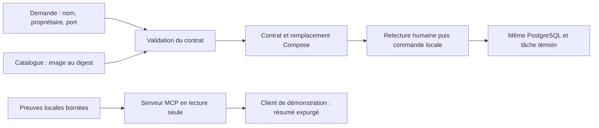

# Jalon 10 — Une offre locale, un outil MCP et un portfolio vérifiable

**Chapitres 19–20 et 22. Atelier exécutable de laboratoire.** Le [registre](../../docs/validation.md) distingue les essais de génération, les échanges MCP et les déploiements réellement effectués. Cet atelier ne crée ni portail d’entreprise ni agent autorisé à modifier une production.

## Le problème

Une consigne orale « redéploie TaskBoard correctement » ne définit ni l’image admise, ni le propriétaire, ni la preuve attendue. Vous allez transformer cette consigne en une offre contrôlée, puis permettre à un outil de lire un petit ensemble de preuves. Le résultat doit être utile à une autre personne sans lui donner un terminal arbitraire.



Le parcours recommandé (*golden path*) est ici une offre de livraison locale réutilisable. Le libre-service (*self-service*) concerne sa génération : l’utilisateur reçoit un résultat sans demander au mainteneur de recopier une configuration. Le démarrage reste une action explicite après relecture. Le protocole MCP relie un client à des outils ; il n’accorde pas les droits métier à la place du programme.

## Prérequis et état d’entrée

Utilisez la version du compagnon indiquée dans le README, Node 24.19.0 et votre laboratoire Compose du jalon 03. Le fichier `preuves/tache-temoin.json` doit encore désigner la tâche conservée. Les ateliers Kubernetes ou d’observabilité utilisent leurs propres environnements ; l’offre de ce jalon modifie **le projet Compose initial**. Ne l’exécutez pas si une autre personne réalise une opération sur ce même laboratoire.

Le catalogue contient une image approuvée par empreinte (*digest*). Elle doit être téléchargeable sur votre architecture. Les limites de l’offre sont : hôte `127.0.0.1`, port 3400–3499, un processeur et 256 Mio pour l’API, aucun changement de volume, une identité de propriétaire sous forme d’alias. Les ports ne démontrent pas à eux seuls l’isolement d’un réseau de production.

```sh
npm run doctor -- --docker
node scripts/platform/catalogue.mjs
node --test scripts/platform/platform.test.mjs scripts/mcp/mcp.test.mjs
```

Le catalogue indique `starts_services: false`. Les tests doivent réussir ; ils vérifient entre autres les refus et les échanges par entrée/sortie standard (*stdio*). Ils ne démarrent pas l’application Compose.

## Étape 1 — Demander une offre

```sh
node scripts/platform/generate.mjs \
  --name equipe-demo --owner apprenant --port 3400
```

Le dossier `work/platform/equipe-demo` contient `contrat.json` et `compose.yaml`. Le contrat reprend le modèle versionné, le propriétaire, l’image et une empreinte du titre du témoin ; il n’expose pas le titre. `compose.yaml` remplace l’image des seuls services `migrate` et `api`, et fixe les limites de ressources de l’API. Il s’ajoute au fichier de base ; ce n’est pas une stack autonome.

La génération ne lance ni Docker ni commande shell. Elle refuse d’écraser un dossier existant. Si vous avez déjà fait l’exercice, examinez ce dossier et réutilisez son contrat cohérent ; pour une nouvelle demande, choisissez un autre nom. La preuve MCP `plateforme`, volontairement bornée, lit uniquement le contrat de `equipe-demo`.

## Étape 2 — Relire puis livrer localement

```sh
cat work/platform/equipe-demo/contrat.json
TASKBOARD_PORT=3400 docker compose \
  -f compose.yaml -f work/platform/equipe-demo/compose.yaml config --quiet
```

La seconde commande contrôle la composition sans démarrer de service. Lisez également les deux fichiers pour vérifier qu’aucun volume ou accès réseau inattendu n’a été ajouté. Téléchargez ensuite la référence exacte présente dans le catalogue ; la commande suivante la lit depuis ce fichier versionné :

```sh
TASKBOARD_IMAGE=$(node -p "JSON.parse(require('node:fs').readFileSync('platform/catalogue.json','utf8')).allowed_image")
docker pull "$TASKBOARD_IMAGE"
TASKBOARD_PORT=3400 docker compose \
  -f compose.yaml -f work/platform/equipe-demo/compose.yaml up -d --no-build
curl --fail --retry 10 --retry-connrefused --retry-delay 1 \
  --max-time 2 http://127.0.0.1:3400/readyz
curl -fsS http://127.0.0.1:3400/version
```

Ces commandes remplacent l’API du projet Compose existant et déplacent son accès local de 3000 vers 3400. Elles conservent `db` et son volume ; aucun nom de projet différent n’est introduit. Attendez la disponibilité, puis exécutez le contrôle du corrigé avec le port 3400. La réussite exige le même identifiant, titre et horodatage, pas la création d’une tâche ressemblante.

## Incident — Une demande hors contrat

```sh
node scripts/platform/generate.mjs \
  --name demande-refusee --port 3401
node scripts/platform/generate.mjs \
  --name demande-refusee --owner apprenant --port 80
node scripts/platform/generate.mjs \
  --name demande-refusee --owner apprenant --port 3401 --image nginx:latest
```

Exécutez chaque demande séparément et observez immédiatement son code avec `echo $?`. Le propriétaire manquant, le port et l’image doivent chacun être refusés avec une explication. Aucun service ne doit être créé. Un message de refus est ici le résultat attendu, pas une permission à contourner.

## Étape 3 — Observer le vrai protocole MCP

```sh
node scripts/mcp/demo.mjs temoin
node scripts/mcp/demo.mjs plateforme
```

Le client démarre le serveur local, demande la version `2025-11-25`, vérifie la réponse de négociation et les capacités, puis envoie la notification de fin d’initialisation. Il appelle `tools/list`, `catalogue_offres`, `lire_preuve`, puis tente un identifiant interdit. Enfin, il ferme l’entrée du serveur et attend son arrêt. Une ligne JSON de protocole ne doit pas être mélangée avec un message de journal sur la sortie standard du serveur.

Le résultat attendu contient `event: mcp_demo_passed`, les deux noms d’outils, `out_of_scope_refused: true` et `clean_exit: true`. Le résumé du témoin contient seulement son identifiant, sa date et `title_sha256`. Il lit un fichier de preuve : **ce résultat ne vérifie pas la disponibilité actuelle de l’API**. Une preuve ancienne peut rester lisible après une panne ; le port 3400 et la relecture métier établissent séparément l’état présent.

Aucun modèle d’intelligence artificielle n’est appelé dans cette démonstration. Vous exercez le protocole et les limites du serveur avant de confier ces outils à un assistant. Les annotations de lecture seule décrivent les outils ; la restriction réelle vient des chemins fixes, des paramètres autorisés et de l’absence de commande de modification.

## Incident MCP, diagnostic et limites

```sh
node scripts/mcp/demo.mjs production
```

La demande doit échouer : `production` n’est pas un identifiant de preuve autorisé. Les seuls identifiants sont `temoin` et `plateforme`. Un argument comme `../../.env` ou un chemin supplémentaire est aussi refusé dans les tests. Pour une preuve valide mais absente ou malformée, l’outil retourne une erreur expurgée plutôt que son contenu brut ou un chemin interne.

Les tests placent une instruction hostile dans le titre d’une tâche de fixture, avec un faux secret supplémentaire. Le serveur ne renvoie ni le titre brut, ni ce champ supplémentaire ; il ne les exécute jamais. Ce contrôle démontre la réduction du contenu transmis dans cet atelier, pas l’impossibilité universelle d’une injection de prompt dans tout assistant. MCP est un format d’échange : l’autorisation et le traitement des données non fiables restent des décisions d’application.

Les bornes sont explicites : messages de 8 Kio, session de 256 messages, preuves de 16 Kio, deux outils, deux identifiants, délai de réponse de trois secondes côté client. Les liens symboliques sont refusés pour les preuves. Le serveur ne propose ni HTTP, ni authentification réseau, ni terminal, ni accès Kubernetes. Le compte local qui le lance conserve les permissions du système ; un serveur MCP local n’est pas un bac à sable de sécurité.

## Étape 4 — Constituer votre portfolio

Créez un document personnel avec cinq pièces : schéma final, décision sur les données, preuve commit/image, restauration et incident expliqué. Pour chaque pièce, indiquez ce qui a été exécuté, conçu seulement et non vérifié. Utilisez des alias et des données fictives. Une capture d’écran verte sans contexte ne remplace pas un résultat rattaché à une version.

Confiez à une autre personne trois tâches : générer une offre valide, comprendre un refus et retrouver la tâche après changement d’image. Demandez-lui de noter une instruction ambiguë. Cette évaluation du lecteur est distincte des tests automatisés ; ne la déclarez pas réalisée si vous avez suivi le parcours seul.

## Nettoyage

```sh
TASKBOARD_PORT=3400 docker compose \
  -f compose.yaml -f work/platform/equipe-demo/compose.yaml down
```

N’ajoutez pas `-v`. Le volume et le témoin restent disponibles. Le client MCP ferme lui-même son serveur. Les fichiers générés sous `work/` sont ignorés par Git ; conservez-les avec votre journal pour examiner la demande. Une demande nouvelle utilise un autre nom ou exige le retrait délibéré du seul dossier de sortie, après vérification.

## Challenge

Expliquez pourquoi le serveur MCP ne doit pas recevoir `path` ou `command` en paramètre. Proposez une troisième preuve utile, son schéma de réponse et ses tests de refus, sans l’implémenter avant d’avoir défini son périmètre. Puis démontrez que l’offre locale conserve le témoin même si son port change.

[Corrigé séparé](corrige.md) · [Détails du protocole](../../docs/plateforme-mcp.md) · [Retour au parcours](../README.md)
